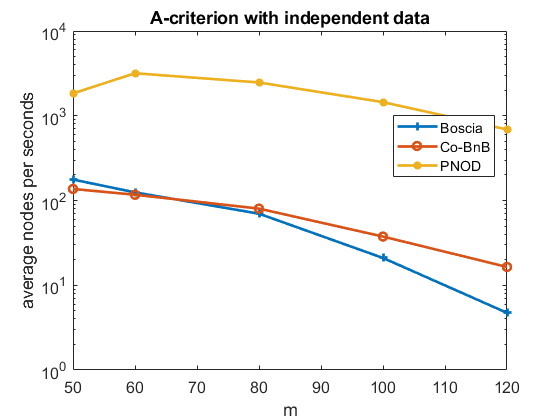
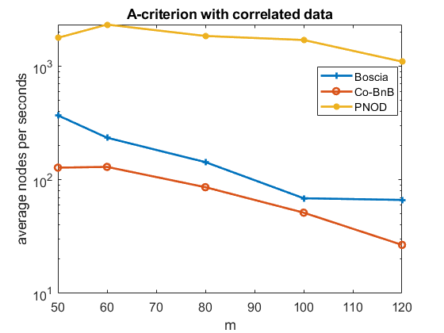
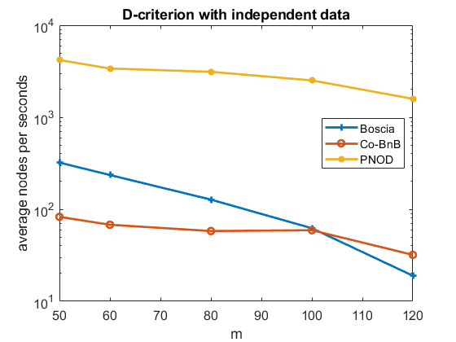
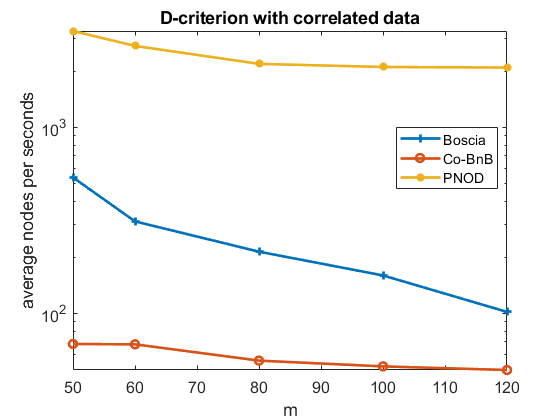
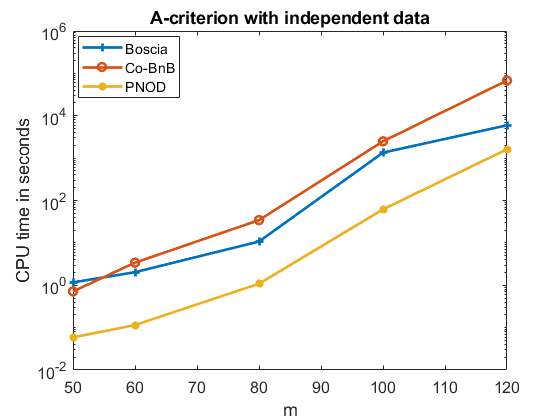
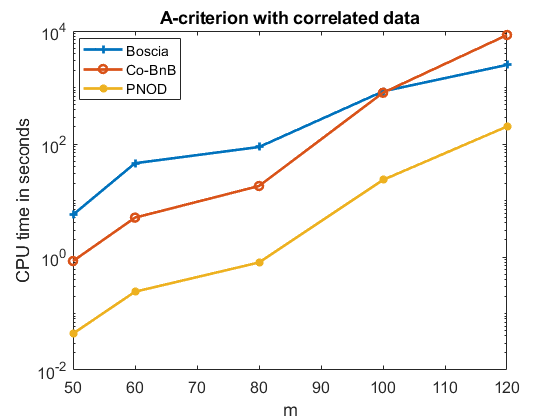
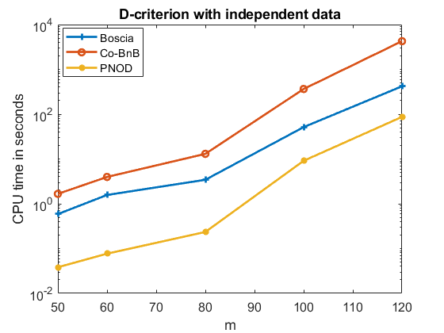
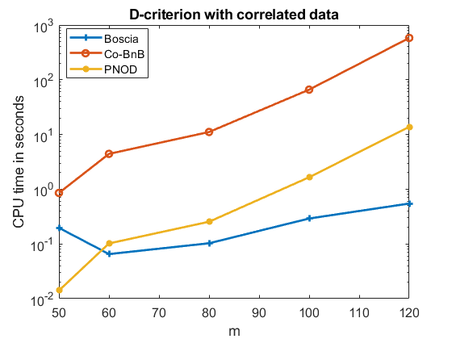
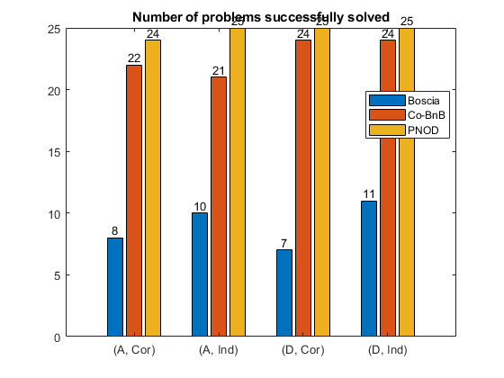

# PNOD.jl

[](https://github.com/liangling98/PNOD.jl/actions/workflows/CI.yml?query=branch%3Amain)

A Julia package on the Projected-Newton-Based framework for Exact Experimental Designs. 

## Important note.

- Codes based on [Bonobo.jl](https://github.com/Wikunia/Bonobo.jl/tree/main) and part of [OptimalDesignWithBoscia](https://github.com/ZIB-IOL/OptimalDesignWithBoscia). 
- The package is still under development. Thus it will invariably be buggy. We would appreciate your feedback and bugs’ report.
- This is a research package. It is not intended nor designed to be a general purpose software at the moment.


## Reproducibility
To reproduce the numerical results in the paper, please just run in your terminal:

```julia
julia run_exp.jl > ./exp_results/log.txt
```

### Nodes evaluated per second







### Total computational time






### Number of instances "successfully solved"

